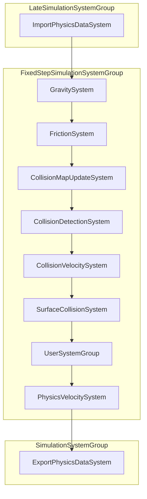

# Pipeline

This page is the **execution-order reference** for Little Physics: which Unity system groups run when, what happens inside each phase, and where you can plug in custom systems.

For the conceptual overview (LOD, spatial map, bootstrap/import/export narrative), see [How it works]().

## Diagram

Each Unity frame, Little Physics runs through four phases. The fixed-step phase repeats **TimeScale × Substeps** times per fixed update.



Public groups (`LittlePhysicsImportGroup`, `LittlePhysicsUserSystemGroup`, `LittlePhysicsExportGroup`) and internal subgroups are shown in the [hierarchy tree](#system-group-hierarchy) below. The fixed-step box repeats **TimeScale × Substeps** times per fixed update.

## System group hierarchy

Exact nesting as defined in the package (`LittlePhysicsSystemGroup.cs`):

```
InitializationSystemGroup
  └─ LittlePhysicsBootstrapSystem

LateSimulationSystemGroup
  └─ LittlePhysicsImportGroup                         [public]
       ├─ (your systems — before internal import)
       ├─ LittlePhysicsInternalImportGroup            [internal]
            ├─ PhysicsStepSystem
            └─ ImportPhysicsDataSystem
       └─ (your systems — after internal import)     [public]

FixedStepSimulationSystemGroup
  └─ LittlePhysicsSystemGroup                         [internal — TimeScale × Substeps loop]
       ├─ LittlePhysicsInternalSystemGroup            [internal]
       │    ├─ GravitySystem
       │    ├─ FrictionSystem
       │    ├─ CollisionMapUpdateSystem
       │    ├─ CollisionDetectionSystem
       │    ├─ CollisionVelocitySystem
       │    └─ SurfaceCollisionSystem
       ├─ LittlePhysicsUserSystemGroup                [public]
       └─ LittlePhysicsLateSystemGroup                [internal]
            └─ PhysicsVelocitySystem

SimulationSystemGroup (UpdateAfter FixedStepSimulationSystemGroup)
  └─ LittlePhysicsExportGroup   
       ├─ (your systems — before internal export)     [public]
       ├─ LittlePhysicsInternalExportGroup            [internal]
       │    └─ ExportPhysicsDataSystem
       └─ (your systems — after internal export)
```

## Public vs internal

| Group | Visibility | Purpose |
|-------|------------|---------|
| `LittlePhysicsBootstrapSystem` | internal | One-time setup: native buffers, settings blobs, singletons, `PhysicsReadyTag` |
| `LittlePhysicsImportGroup` | **public** | Late-update import; user systems run **before** internal import |
| `LittlePhysicsInternalImportGroup` | internal | Camera/LOD step + copy ECS data into `BodiesList` |
| `LittlePhysicsSystemGroup` | internal | Owns the TimeScale × Substeps loop; sets `LittlePhysicsTimeComponent` each iteration |
| `LittlePhysicsInternalSystemGroup` | internal | Core simulation: gravity → friction → map → collisions → surface |
| `LittlePhysicsUserSystemGroup` | **public** | Mid-step custom logic (after collisions, before velocity → position) |
| `LittlePhysicsLateSystemGroup` | internal | Integrates velocity into position data in native buffers |
| `LittlePhysicsExportGroup` | **public** | Post-fixed-step write-back; internal export runs **first** |
| `LittlePhysicsInternalExportGroup` | internal | Copies native results back to ECS components and transforms |

Only the three **public** groups are intended extension points. Internal systems and groups may change between package versions.

## Phase details

### Initialization — bootstrap

`LittlePhysicsBootstrapSystem` runs **once** in `InitializationSystemGroup`. It requires baked `PhysicsSettingsAuthoring` and `SpacialMapAuthoring` data before it proceeds.

It allocates native structures on `PhysicsStructuresComponent` (body list, entity map, collision maps, random streams), builds settings blobs, creates `LittlePhysicsTimeComponent` and `SimulationDataComponent`, and adds **`PhysicsReadyTag`** at the very end.

All other Little Physics systems — and your custom systems — should gate on readiness:

```csharp
state.RequireForUpdate<PhysicsReadyTag>();
```

See [PhysicsReadyTag]().

### Late update — import

`LittlePhysicsImportGroup` runs in `LateSimulationSystemGroup`.

| Step | System | What it does |
|------|--------|--------------|
| 1 | **Your systems** (optional) | Modify ECS components before they enter native memory |
| 2 | `PhysicsStepSystem` | Updates `PhysicsStepComponent` with main-camera position, forward, and projection (used for LOD) |
| 3 | `ImportPhysicsDataSystem` | Counts bodies (respecting `MaxEntitiesCount`), assigns body indices, computes LOD tiers, copies data into `BodiesList` and `EntitiesMap` |
| 4 | **Your systems** (optional) | Modify data structures after they enter native memory |

Import is the handoff from baked components to the unmanaged pool used during the fixed-step loop. `SimulationDataComponent.ActiveBodiesCount` reflects how many bodies participate in the current step.

### Fixed update — inner loop

`LittlePhysicsSystemGroup` runs inside `FixedStepSimulationSystemGroup`. Each fixed tick it nests:

- **Time scale** — from [`LittlePhysicsTimeComponent`](). Values `0` (pause), `1`, `2`, or `4`. Scale `2` runs the inner pipeline twice; `0` skips simulation entirely.
- **Substeps** — from `PhysicsSettingsAuthoring` (**1–4**). Each substep uses `fixedDeltaTime / substepsCount` as `LittlePhysicsTimeComponent.DeltaTime`.

Example: time scale **2** and **2** substeps → **4** full inner loops per fixed update.

Each inner iteration runs three child groups in order:

#### 1. `LittlePhysicsInternalSystemGroup`

| Order | System | Role |
|------:|--------|------|
| 1 | `GravitySystem` | Directional and radial gravity on dynamic bodies |
| 2 | `FrictionSystem` | Air and surface friction |
| 3 | `CollisionMapUpdateSystem` | Inserts dynamic/kinematic bodies into spatial-map cells; statics inserted once |
| 4 | `CollisionDetectionSystem` | Clears pair/collision buffers, **collects unique body pairs** (LOD-capped), runs **narrow-phase intersection** |
| 5 | `CollisionVelocitySystem` | Resolves object-to-object contacts: impulse and push-out on dynamic bodies |
| 6 | `SurfaceCollisionSystem` | Tests **every dynamic body against all surfaces** each substep (not LOD-skipped) |

#### 2. `LittlePhysicsUserSystemGroup`

Your custom systems and package job interfaces (`IBodiesJob`, `ICollisionJob`, `ISurfaceJob`, `ILineCastJob`) run here — **after** collision data is available, **before** positions are integrated.

Use `LittlePhysicsTimeComponent.DeltaTime` inside this group for the scaled substep delta.

#### 3. `LittlePhysicsLateSystemGroup`

`PhysicsVelocitySystem` integrates linear and angular velocity into `PositionData` inside native buffers.

### Simulation — export

`LittlePhysicsExportGroup` runs in `SimulationSystemGroup`, **after** `FixedStepSimulationSystemGroup` completes.

| Step | System | What it does |
|------|--------|--------------|
| 1 | **Your systems** (optional) | Read or modify data structures before the internal write-back |
| 2 | `ExportPhysicsDataSystem` | Writes position, rotation, and velocity from native structures back to ECS components and transforms |
| 3 | **Your systems** (optional) | Read or modify components after the internal write-back |

## Custom system hook points

Three public groups accept user systems. Use `[UpdateInGroup(...)]` plus ordering attributes relative to the internal child group.

### Import — modify components or native data

```csharp
// Before internal import — change ECS components
[UpdateInGroup(typeof(LittlePhysicsImportGroup))]
[UpdateBefore(typeof(LittlePhysicsInternalImportGroup))]
public partial struct MyPreImportSystem : ISystem { ... }

// After internal import — read or alter BodiesList, collision maps, etc.
[UpdateInGroup(typeof(LittlePhysicsImportGroup))]
[UpdateAfter(typeof(LittlePhysicsInternalImportGroup))]
public partial struct MyPostImportSystem : ISystem { ... }
```

### Mid-step — forces, gameplay, debug

```csharp
[UpdateInGroup(typeof(LittlePhysicsUserSystemGroup))]
public partial struct MyMidStepSystem : ISystem { ... }
```

Prefer the package job interfaces in this group. See [Custom jobs]().

### Export — read structures or post-process components

```csharp
// Before internal export — read native structures before write-back
[UpdateInGroup(typeof(LittlePhysicsExportGroup))]
[UpdateBefore(typeof(LittlePhysicsInternalExportGroup))]
public partial struct MyPreExportSystem : ISystem { ... }

// After internal export — modify components or transforms
[UpdateInGroup(typeof(LittlePhysicsExportGroup))]
[UpdateAfter(typeof(LittlePhysicsInternalExportGroup))]
public partial struct MyPostExportSystem : ISystem { ... }
```

| Hook | Update phase | Read/write | Typical use |
|------|--------------|------------|-------------|
| Import, before internal | LateSimulation | ECS components | Override transforms, layers, or flags before copy |
| Import, after internal | LateSimulation | Native structures | Patch `BodiesList` after import |
| `LittlePhysicsUserSystemGroup` | FixedStep (inner loop) | Native structures | Forces, custom collision response, gameplay |
| Export, before internal | Simulation | Native structures | Read final native state before write-back |
| Export, after internal | Simulation | ECS components | Sync to rendering, networking, or custom components |

For workflow details and examples, see [Custom job groups](), [Import workflow](), and [Export workflow]().

## Chaining jobs with `PhysicsJobHandle`

Every internal physics system and package job extension schedules work through `SimulationDataComponent.PhysicsJobHandle`. Custom jobs that touch native structures during import, the fixed-step loop, or export must **combine** with this handle and **write it back** when done:

```csharp
ref var simulation = ref SystemAPI.GetSingletonRW<SimulationDataComponent>().ValueRW;
var combined = JobHandle.CombineDependencies(state.Dependency, simulation.PhysicsJobHandle);

var handle = myJob.Schedule(combined);
simulation.PhysicsJobHandle = handle;
state.Dependency = handle;
```

If you skip this, your job may run concurrently with physics jobs and corrupt native arrays.

Inside `LittlePhysicsUserSystemGroup`, the job interfaces (`IBodiesJob`, `ICollisionJob`, etc.) handle chaining for you via their extension methods.

See [SimulationDataComponent]().

## Quick reference — one fixed update

```
LateSimulation
  Import (components → BodiesList, LOD, ActiveBodiesCount)

FixedStep  ×  (TimeScale iterations)
  each iteration  ×  (SubstepsCount iterations)
    Gravity → Friction → Spatial map → Pairs + detection → Velocity/push-out → Surface
    → [User systems]
    → Velocity → position

Simulation (after all fixed-step work)
  Export (BodiesList → components / transforms)
  → [User export systems]
```

## What to read next

| Topic | Page |
|-------|------|
| Concepts — LOD, spatial map, one-frame narrative | [How it works]() |
| Import / export / mid-step workflows | [Custom jobs]() |
| `BodiesList`, collision maps, singleton access | [Physics singleton]() |
| `IBodiesJob`, `ICollisionJob`, `ISurfaceJob`, `ILineCastJob` | [Custom jobs]() |
| Raw `IJob` / `IJobParallelFor` against native buffers | [Custom job interfaces]() |
| Settings, body types, LOD, spatial map | [Settings]() |
